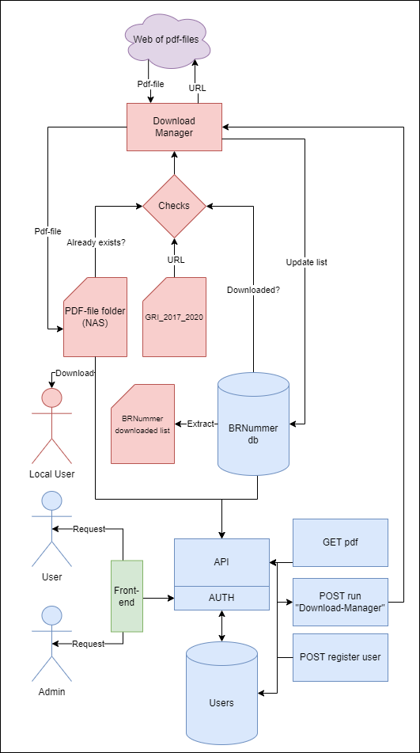

# PDF Downloader

## Specificaftions
This project will download specified PDF files from `GRI_2017_2020.xlsx` with URL from column AL: `Pdf_URL` or column AM: `Report Html Address`.
Gives a list of the downloaded pdf files with naming of the column A: `BRNummer` and whether the file has been downloaded.
Also we need a `downloaded list` with a column of download status: `pdf_downloaded` needs to update wether or not the file has been downloaded.
This list will initially be updated in a database, and the list can later be extracted to a file if required.
The program needs to handle future pdf downloading of new updated URL lists.
The PDF-files needs to be accessable through the NAS or other ways.

I will create a download manager with checks like `already downloaded` `download unavailable`, successfully downloaded files will be stored at a specified folder-path (which could be a NAS).
The download manager should also have limiters like; `run time` `max file download` `bandwidth limit`.

I will create a database to store information about the `downloaded` and `not downloaded` files where a .csv list file can be extracted if required.

Files will be accessable through the folder-path.

If I have extra time for the week i will implement a simple front-end website with search and login features.
And create a basic CRUD API using RESTful architecture. In python using SQLAlchemy ORMs in a MySQL database with FastAPI for the endpoints. 
If ran locally the files should be gotten with a reference to the local file-path. And if accessed remotely it should be downloaded through the API.

##### Technologies
Status | Technologies |
:---:| --- |
✅| Python
✅| MySQL 
Extras:
✅| FastAPI
✅| SQLAlchemy
⬜| React 

##### Featurelist
Status | Feature | Comment
:---:| --- | --- 
✅| Pdf download manager
⚠️| ~~Updating of `Metadata2006-2016.xlsx`~~ | No longer needed
✅| Database of `BRNummer` pdf-files with .csv file extract
✅| Specified folder-path storage of pdf-files
Extras:
⬜| FastAPI in front-end: Login Page for remote access of files
⬜| FastAPI in front-end: Admin operation to run the download manager

##### Basic requirements - Time estimates
Status | Requirement | Time | Comment
:---:| --- | --- | ---
Day 1|  | 6h | Up to 2h extra
✅| Download manager: Basic | 30m | Day 1
✅| Download manager: Limiter of downloads | 30m | Day 1
✅| Download manager: Try-catch of requirements | 1h | Day 1
✅| Download manager: Optimise for speed | 2h | Day 1
✅| Download manager: Optimise for stability | 2h | Day 1
✅| Tests: unit-tests / manual-tests for todays work | 30m | Day 1
Day 2|  | 6h | Up to 2h extra
✅| Database: Setup ORMs | 1h | Day 2
✅| Database: Setup connection | 1h | Day 2
✅| Database: Setup tables and columns | 30m | Day 2
✅| Download manager: Update ~~metadata and~~ database status of downloaded files | 1h | Day 2
✅| API: Setup basic FastAPI connection | 30m | Day 2
✅| Tests: unit-tests / manual-tests for todays work | 1h | Day 2
Day 3|  | 6h | Up to 2h extra
⬜| Download manager: Handle excel select, solve requried vs extra values | 2h | Day 3
⬜| API: POST: Uploaded new excel or csv files | 2h | Day 3
✅| API: GET for local pdf-references with search and range limit | 1h | Day 3
✅| API: GET for remote pdf-file download with search and range limit | 1h | Day 3
✅| API: POST to run download manager with limiter options | 2h | Day 3
✅| API: AUTH of user and admin | 2h | Day 3
Day 4|  | 6h | Up to 2h extra
⬜| Front-end: Basic structure | 1h | Day 4
⬜| Front-end: Login page | 1h | Day 4
⬜| Front-end: Basic download page | 1h | Day 4
⬜| Front-end: advanced search download page | 3h | Day 4
⬜| Front-end: Admin can register new users | 2h | Day 4
Day 5|  | 6h | Up to 2h extra
⬜| Tests: unit-tests / manual-tests | 2h | Day 5
⬜| Easy launch and setup: launch script, etc | 2h | Day 5
⬜| Documentation: Readme, Setup and charts | 2h | Day 5
Total |  | 30h-40h | 5 Days

##### Diagrams



# Installation

## Python environment

1. Create environment:
    ```
    python -m venv .venv
    ```

2. Activate environment:
    ```
    .venv\Scripts\activate
    ```

3. Install requirements:
    ```
    pip install -r requirements.txt
    ```

## Create Database
1. Create a mysql database with MySQL workbench or other ways


## Create Secret Files
1. Create a `db_info.json` at `/`

2. Add secret information
Example:
```
{   
    "username": "root",
    "password": "root",
    "db_name": "database_name",
    "test_db_name": "test_database_name",
    "hostname": "localhost"
}
```

3. Create a `jwt_info.json` at `/`

4. Add secret information
Example:
```
{
    "secret_key": "secret",
    "algorithm": "HS256",
    "access_token_expire_minutes": 60
}
```


## Install Front-end React requirements
1. Install Node.js
    [https://nodejs.org](https://nodejs.org)

2. npm install at app location

Go to
```
/front-end/pdf-downloader-app
```
Run
```
npm install
```

## Run API and Front-end

1. Launch API service at main.py location

Open 1st terminal and go to
```
/
```
Run
```
uvicorn main:app --reload
```
Launch browser
```
localhost:8000/docs
```

2. Lauch React Front-end at App location

Open 2nd terminal and go to
```
/front-end/pdf-downloader-app
```
Run
```
npm start
```
Launch browser
```
localhost:3000
```

3. Login with the generated base users:

| User Type | Username | Password |
| --------- | -------- | -------- |
| Admin     | `admin`  | `admin`  |
| Normal    | `user`   | `user`   |